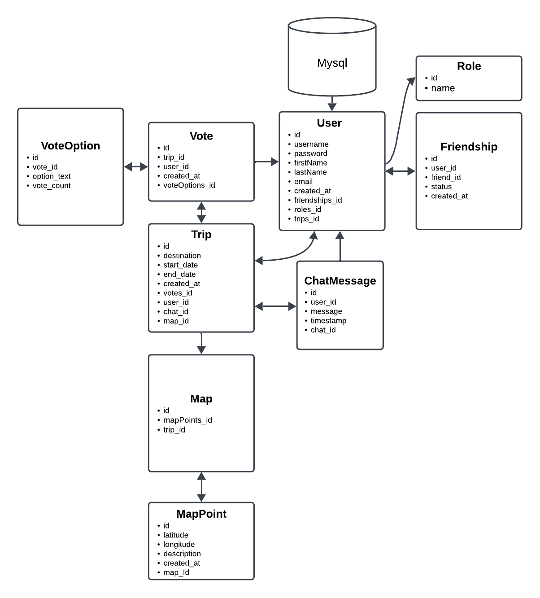

# Tripsters Application

**Tripsters** is a full-featured application designed to manage trips, friendships, voting, messaging, and map points for users planning shared adventures.

## Project Overview

The application allows users to:
- Create and manage trips
- Invite friends
- Vote on trip decisions
- Exchange messages
- Map out trip routes

## Features:
- **User Registration & Authentication**: Sign up, log in, and manage accounts
- **Trip Management**: Create, update, delete trips, add users to trips
- **Friendship Management**: Add, update, or delete friends, view all friendships
- **Voting System**: Create votes and options, allow users to vote
- **Chat System**: Send and receive messages within trips
- **Map Management**: Add, view, and remove map points

## Technologies Used

- **Spring Boot**
- **Spring Security**
- **Spring Data JPA**
- **Hibernate Validator**
- **Lombok**
- **MapStruct**
- **Swagger**
- **Liquibase**

## API Endpoints

### Authentication
- `POST /auth/registration` - Register a new user
- `POST /auth/login` - User login

### Trip Management
- `POST /trip` - Create a new trip
- `PUT /trip` - Update trip details
- `DELETE /trip/{tripId}` - Delete a trip
- `GET /trip` - Get all trips for the current user
- `GET /trip/{tripId}` - Get trip details
- `GET /trip/user/{userId}` - Get trips for a specific user

### Vote Management
- `POST /votes` - Create a new vote
- `GET /votes/{voteId}` - Get vote details
- `GET /votes/trip/{tripId}` - Get all votes for a specific trip

### Friendship Management
- `POST /friends` - Add a new friend
- `GET /friends` - Get all friends
- `DELETE /friends/{friendId}` - Remove a friend

### Messaging
- `POST /message` - Send a message
- `GET /message/trip/{tripId}` - Get all messages in a trip
- `DELETE /message/{messageId}` - Delete a message

### Map Management
- `POST /map` - Add a new map point
- `GET /map/trip/{tripId}` - Get all map points for a specific trip
- `DELETE /map/{mapId}` - Remove a map point

# Models and relations

